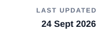
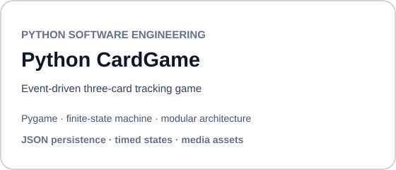
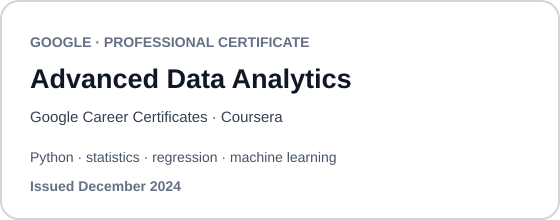
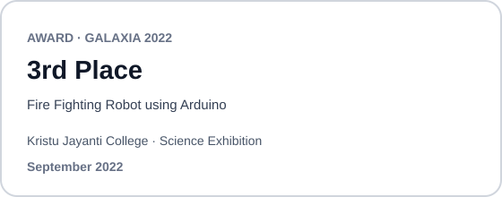
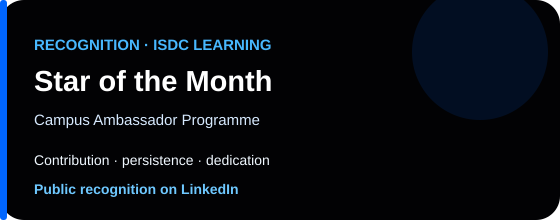

 

  
  &nbsp;&nbsp;
  
  &nbsp;&nbsp;
  
  &nbsp;&nbsp;
  
  &nbsp;&nbsp;&nbsp;&nbsp;
  
  &nbsp;
  
  &nbsp;
  

---

## About me

Final-year MSc student in Data Science, Signal &amp; Image Processing at , after completing a BSc in Computer Science &amp; Electronics from , Bangalore. I moved from general computing and electronics toward <strong>applied machine learning, computer vision, and image processing</strong>, because I learn best by implementing, testing, and comparing results.

My current work spans <strong>image processing and computer vision</strong>: filtering, segmentation, camera calibration, and feature-based tracking, as well as deep learning and multimodal machine learning. I mainly use Python, PyTorch, OpenCV, scikit-learn, NumPy, and SciPy. Recent projects include a <a href="https://github.com/denoskume/Background-Subtraction-Fluoroscopy">background subtraction pipeline</a> and <a href="https://github.com/denoskume/CLAP-Zero-Shot-Audio-Classification">CLAP-based zero-shot audio classification</a>; broader work is documented in my <a href="https://github.com/denoskume/msc-coro-dassip-portfolio">MSc portfolio</a>. I also built <a href="https://github.com/denoskume/monstage">MonStage</a>, a React/TypeScript internship platform.

My experience in <strong>AI evaluation and data analysis</strong> trained me to question outputs, check evidence, and explain why a result is reliable, or not.

I am seeking a <strong>6-month final-year internship starting February 2027</strong> in applied machine learning, computer vision, or image processing.

---

## Education

**MSc Data Science, Signal & Image Processing**  
Centrale Nantes · Nantes, France · `2025 - 2027 (expected)`  

**BSc Computer Science & Electronics**  
Kristu Jayanti University · Bangalore, India · `2021 - 2025`

---

## Professional Experience

### Speech AI Evaluation Specialist
**RWS Moravia** · Freelance · Remote · Aug 2026 - Present

- Evaluate French speech-to-speech interactions across **5 quality dimensions**: accuracy, naturalness, usefulness, conversational quality, and audio quality.
- Compare model outputs using structured criteria to support consistent, evidence-based quality decisions.
- Identify linguistic, conversational, and speech-related failure patterns that can reduce response quality in voice AI systems.

### AI Response Evaluator
**DataAnnotation** · Freelance · Remote · Feb 2026 - Jun 2026

- Evaluated AI-generated responses across **4 core criteria**: correctness, reasoning quality, relevance, and instruction following.
- Reviewed multimodal tasks spanning **text, files, images, and multi-step interactions**.
- Produced evidence-based feedback that isolated errors, inconsistencies, and response-quality issues for model evaluation.

### Data Analyst Intern
**Unified Mentor** · Internship · Bangalore, India · Sep 2024 - Dec 2024

- Used Python to clean, explore, and interpret structured datasets during a **3-month data analytics internship**.
- Converted exploratory analysis into visual summaries that made key patterns easier to identify and communicate.
- Turned analytical findings into concise reports designed to support clear, data-backed interpretation.

---

## Selected Projects

  
  

  
  

| Project | Evidence |
| --- | --- |
| **Background Subtraction** | Spatial/spectral filtering, morphology, segmentation, **SAD · MSE · PSNR · Dice · IoU** |
| **CLAP Audio Classification** | **91.15% Top-1 · 97.45% Top-3 · 99.00% Top-5 · +8.10 pp** |
| **Python CardGame** | Python modules, Pygame, finite-state machine, event-driven logic, JSON persistence |
| **MonStage** | Responsive UI, authentication, ranking/filtering, Cloudflare Worker, Apps Script, GitHub Actions |

---

## Technical Stack

<table align="center">
  <tr>
    <td align="center" width="100">
       
      <b>Python</b>
    </td>
    <td align="center" width="100">
       
      <b>NumPy</b>
    </td>
    <td align="center" width="100">
       
      <b>SciPy</b>
    </td>
    <td align="center" width="100">
       
      <b>Matplotlib</b>
    </td>
    <td align="center" width="100">
       
      <b>OpenCV</b>
    </td>
  </tr>
  <tr>
    <td align="center" width="100">
       
      <b>PyTorch</b>
    </td>
    <td align="center" width="100">
       
      <b>Jupyter</b>
    </td>
    <td align="center" width="100">
       
      <b>VS Code</b>
    </td>
    <td align="center" width="100">
       
      <b>Linux</b>
    </td>
    <td align="center" width="100">
       
      <b>Git</b>
    </td>
  </tr>
</table>

---

## Credentials & Recognition

  
  

  

  <a href="https://github.com/denoskume/certifications-and-awards">View credential archive →</a>

