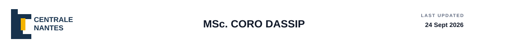
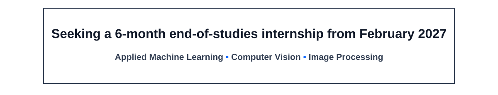
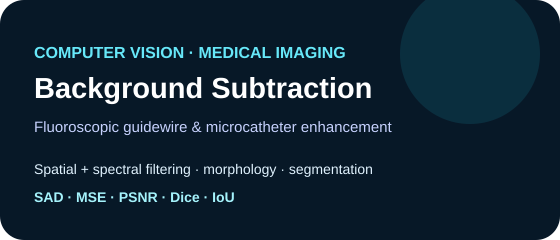
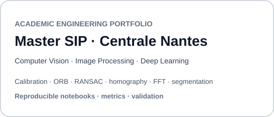
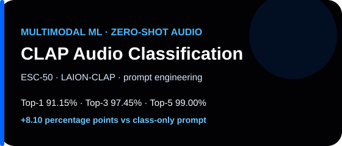
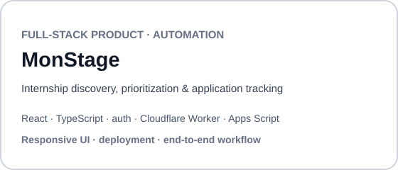

  
  &nbsp;
  
  &nbsp;
  

  <a href="#about-me"><strong>About me</strong></a>
  &nbsp;&nbsp;&nbsp;&nbsp;&nbsp;&nbsp;&nbsp;&nbsp;
  <a href="https://github.com/denoskume/Master_SIP_EC-Nantes/tree/main/Lab_Works"><strong>Lab work</strong></a>
  &nbsp;&nbsp;&nbsp;&nbsp;&nbsp;&nbsp;&nbsp;&nbsp;
  <a href="https://github.com/denoskume/Master_SIP_EC-Nantes/tree/main/Projects"><strong>Projects</strong></a>

---

## About me

Final-year MSc student at **Centrale Nantes** with solid foundations developed through academic work, technical projects, and AI/data evaluation experience. I am still developing my expertise and looking for an engineering environment where I can **learn quickly, contribute to real problems, and grow**.

My current professional direction is **Applied Machine Learning, Computer Vision, and Image Processing**, supported by broader training in **Data Science, Signal Processing, Deep Learning, and numerical methods**.

---

## Professional Experience

### RWS — Speech AI Evaluation Specialist
**Freelance · Remote · France** · `Aug 2026 → Present`

- Evaluate French speech-to-speech AI interactions for **accuracy, naturalness, usefulness, conversational quality, and audio quality**.
- Compare model responses using structured evaluation criteria and evidence-based assessments.
- Identify linguistic, conversational, and speech-related quality issues in voice-based AI systems.

### DataAnnotation — AI Response Evaluator
**Remote** · `Feb 2026 → Jun 2026`

- Evaluated AI-generated responses for **correctness, reasoning quality, relevance, and instruction following**.
- Reviewed multimodal tasks involving text, files, images, and multi-step interactions.
- Provided evidence-based feedback on errors, inconsistencies, and quality issues.

### Unified Mentor — Data Analyst Intern
`Sep 2024 → Dec 2024`

- Cleaned, explored, and interpreted structured datasets using Python workflows.
- Performed exploratory analysis and produced visual summaries of key patterns.
- Communicated findings through concise analytical reporting.

[View internship credential →](https://github.com/denoskume/certifications-and-awards/blob/main/experience/Unified_Mentor_Data_Analyst_Internship_2024.pdf)

---

## Selected Projects

  
  

  
  

| Project | Evidence |
| --- | --- |
| **Background Subtraction** | Spatial/spectral filtering, morphology, segmentation, **SAD · MSE · PSNR · Dice · IoU** |
| **Master SIP** | Camera calibration, ORB, RANSAC, homography, FFT, segmentation, PyTorch evaluation |
| **CLAP Audio Classification** | **91.15% Top-1 · 97.45% Top-3 · 99.00% Top-5 · +8.10 pp** |
| **MonStage** | Responsive UI, authentication, ranking/filtering, Cloudflare Worker, Apps Script, GitHub Actions |

---

## Technical Stack

**Programming & Data**  
Python · NumPy · pandas · SciPy · scikit-learn · Matplotlib · Jupyter

**Machine Learning & Vision**  
PyTorch · OpenCV · model evaluation · classification · camera calibration · ORB · RANSAC · homography · segmentation · morphology · FFT

**Engineering**  
Git · GitHub · VS Code · WSL/Ubuntu · GitHub Actions

---

## Education

### Centrale Nantes
**MSc — Data Science, Signal & Image Processing** · `2025 → 2027`

Data science · signal processing · image processing · machine learning · deep learning · computer vision · optimization

### Kristu Jayanti College
**BSc — Computer Science & Electronics** · `2021 → 2025`

Programming · computer science · electronics · mathematics · applied technical problem solving

---

## Credentials & Recognition

- **[Google Advanced Data Analytics Professional Certificate](https://github.com/denoskume/certifications-and-awards/blob/main/certifications/Google_Advanced_Data_Analytics_2024.pdf)** — Google / Coursera
- **[3rd Place — Fire Fighting Robot using Arduino](https://github.com/denoskume/certifications-and-awards/blob/main/awards/Fire_Fighting_Robot_GALAXIA_3rd_Place_2022.jpg)** — GALAXIA Science Exhibition
- [Credential archive →](https://github.com/denoskume/certifications-and-awards)

---

**February 2027 · 6 months · France**  
**Applied Machine Learning • Computer Vision • Image Processing**

