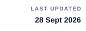
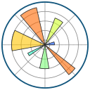

 

  
  &nbsp;&nbsp;
  
  &nbsp;&nbsp;
  
  &nbsp;&nbsp;
  
  &nbsp;&nbsp;&nbsp;&nbsp;
  
  &nbsp;
  
  &nbsp;
  

---

## About me

I am currently finishing an MSc in Data Science, Signal & Image Processing at Centrale Nantes. Before that, I completed a BSc in Computer Science & Electronics at Kristu Jayanti University in Bengaluru.

Most of my work is hands-on. I like building a method, testing it, comparing the results, and understanding where it works well or falls short. My recent projects cover image filtering, segmentation, camera calibration, feature tracking, deep learning, and multimodal machine learning.

I mainly work with Python and its data and machine learning ecosystem, including NumPy, pandas, SciPy, scikit-learn, Matplotlib, Jupyter, PyTorch, and OpenCV. These tools support the way I work: preparing data, testing methods, comparing results, and checking where a model or pipeline performs well or starts to fail. My experience in AI evaluation has reinforced that habit of looking closely at outputs and explaining results with evidence.

I am looking for a **6-month final-year internship starting February 2027** where I can contribute with these foundations, keep learning, and work on real problems in Data Science, Applied Machine Learning, Computer Vision, Deep Learning, or Image Processing.

---

## Education

**MSc Control and Robotics — Data Science, Signal & Image Processing**  
Centrale Nantes · Nantes, France · `2025 - 2027 (expected)`  
Focused on modelling, numerical experimentation, optimisation, and method evaluation.

**BSc Computer Science & Electronics**  
Kristu Jayanti University · Bengaluru, India · `2021 - 2024`  
Multidisciplinary training in software development, digital systems, and embedded technologies.

---

## Experience

### Speech AI Evaluation Specialist
**RWS Moravia** · Freelance · Remote · Aug 2026 - Present

- Evaluated French speech-to-speech AI outputs using structured evaluation criteria.
- Identified linguistic, conversational, and audio-related issues.
- Wrote evidence-based rationales to compare AI responses.

### Data Analyst Intern
**Unified Mentor Pvt. Ltd.** · Internship · Bengaluru, India · Sep 2024 - Dec 2024

- Cleaned and analyzed structured datasets using Python, pandas, and NumPy.
- Performed exploratory data analysis and created Power BI dashboards.
- Summarized findings in concise data reports.

---

## Selected Projects

  
  &nbsp;&nbsp;
  

  
  &nbsp;&nbsp;
  

---

## Technical Stack

<table align="center">
  <tr>
    <th colspan="8">Programming &amp; Data</th>
  </tr>
  <tr>
    <td align="center" width="100"> <b>Python</b></td>
    <td align="center" width="100"> <b>TypeScript</b></td>
    <td align="center" width="100"> <b>NumPy</b></td>
    <td align="center" width="100"> <b>pandas</b></td>
    <td align="center" width="100"> <b>SciPy</b></td>
    <td align="center" width="100"> <b>scikit-learn</b></td>
    <td align="center" width="100"> <b>Matplotlib</b></td>
    <td align="center" width="100"> <b>Jupyter</b></td>
  </tr>

  <tr>
    <th colspan="8">Engineering &amp; Applications</th>
  </tr>
  <tr>
    <td align="center"> <b>React</b></td>
    <td align="center"> <b>Vite</b></td>
    <td align="center"> <b>Pygame</b></td>
    <td align="center"> <b>Git</b></td>
    <td align="center"> <b>GitHub</b></td>
    <td align="center"> <b>VS Code</b></td>
    <td align="center"> <b>Linux</b></td>
    <td align="center"> <b>GitHub Actions</b></td>
  </tr>

  <tr>
    <th colspan="8">Machine Learning, Vision &amp; Audio</th>
  </tr>
  <tr>
    <td align="center"> <b>PyTorch</b></td>
    <td align="center"> <b>OpenCV</b></td>
    <td align="center"> <b>torchaudio</b></td>
    <td align="center"> <b>librosa</b></td>
    <td align="center"> <b>LAION-CLAP</b></td>
    <td align="center"> <b>Pillow</b></td>
    <td></td>
    <td></td>
  </tr>

  <tr>
    <th colspan="8">Web &amp; Cloud</th>
  </tr>
  <tr>
    <td align="center"> <b>Node.js</b></td>
    <td align="center"> <b>npm</b></td>
    <td align="center"> <b>Cloudflare</b></td>
    <td align="center"> <b>Apps Script</b></td>
    <td align="center"> <b>Google Sheets</b></td>
    <td></td>
    <td></td>
    <td></td>
  </tr>
</table>

---

## Credentials & Recognition

  
  &nbsp;&nbsp;
  

  
  &nbsp;&nbsp;
  

  

